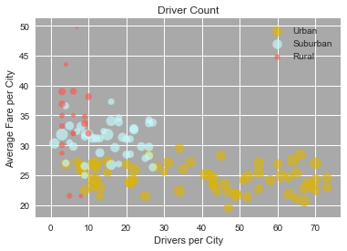
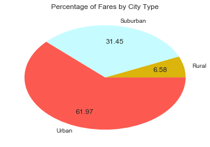
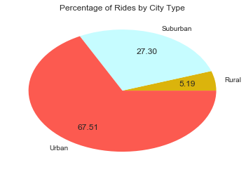
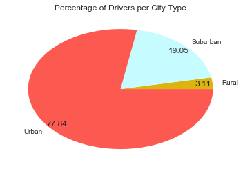

# Pyber Data Analysis

## Part 1: Bubble Plot


```python
import pandas as pd
from matplotlib import pyplot as plt
import seaborn

seaborn.set()
seaborn.set_palette(seaborn.xkcd_palette([
    "gold",
    "light sky blue",
    "coral",
]))
seaborn.set_style({"axes.facecolor": "darkgray"})
```


```python
fare_data = pd.read_csv("ride_data.csv")
fare_data.head()
```

<table border="1" class="dataframe">
  <thead>
    <tr style="text-align: right;">
      <th></th>
      <th>city</th>
      <th>date</th>
      <th>fare</th>
      <th>ride_id</th>
    </tr>
  </thead>
  <tbody>
    <tr>
      <th>0</th>
      <td>Sarabury</td>
      <td>2016-01-16 13:49:27</td>
      <td>38.35</td>
      <td>5403689035038</td>
    </tr>
    <tr>
      <th>1</th>
      <td>South Roy</td>
      <td>2016-01-02 18:42:34</td>
      <td>17.49</td>
      <td>4036272335942</td>
    </tr>
    <tr>
      <th>2</th>
      <td>Wiseborough</td>
      <td>2016-01-21 17:35:29</td>
      <td>44.18</td>
      <td>3645042422587</td>
    </tr>
    <tr>
      <th>3</th>
      <td>Spencertown</td>
      <td>2016-07-31 14:53:22</td>
      <td>6.87</td>
      <td>2242596575892</td>
    </tr>
    <tr>
      <th>4</th>
      <td>Nguyenbury</td>
      <td>2016-07-09 04:42:44</td>
      <td>6.28</td>
      <td>1543057793673</td>
    </tr>
  </tbody>
</table>


```python
city_data = pd.read_csv("city_data.csv")
city_data.head()
```

<table border="1" class="dataframe">
  <thead>
    <tr style="text-align: right;">
      <th></th>
      <th>city</th>
      <th>driver_count</th>
      <th>type</th>
    </tr>
  </thead>
  <tbody>
    <tr>
      <th>0</th>
      <td>Kelseyland</td>
      <td>63</td>
      <td>Urban</td>
    </tr>
    <tr>
      <th>1</th>
      <td>Nguyenbury</td>
      <td>8</td>
      <td>Urban</td>
    </tr>
    <tr>
      <th>2</th>
      <td>East Douglas</td>
      <td>12</td>
      <td>Urban</td>
    </tr>
    <tr>
      <th>3</th>
      <td>West Dawnfurt</td>
      <td>34</td>
      <td>Urban</td>
    </tr>
    <tr>
      <th>4</th>
      <td>Rodriguezburgh</td>
      <td>52</td>
      <td>Urban</td>
    </tr>
  </tbody>
</table>
</div>


```python
avg_fare_per_city = fare_data.groupby("city").mean()
avg_city_fare_typed = avg_fare_per_city.join(city_data.set_index("city"))
avg_city_fare_typed.head()
```


<table border="1" class="dataframe">
  <thead>
    <tr style="text-align: right;">
      <th></th>
      <th>fare</th>
      <th>ride_id</th>
      <th>driver_count</th>
      <th>type</th>
    </tr>
    <tr>
      <th>city</th>
      <th></th>
      <th></th>
      <th></th>
      <th></th>
    </tr>
  </thead>
  <tbody>
    <tr>
      <th>Alvarezhaven</th>
      <td>23.928710</td>
      <td>5.351586e+12</td>
      <td>21</td>
      <td>Urban</td>
    </tr>
    <tr>
      <th>Alyssaberg</th>
      <td>20.609615</td>
      <td>3.536678e+12</td>
      <td>67</td>
      <td>Urban</td>
    </tr>
    <tr>
      <th>Anitamouth</th>
      <td>37.315556</td>
      <td>4.195870e+12</td>
      <td>16</td>
      <td>Suburban</td>
    </tr>
    <tr>
      <th>Antoniomouth</th>
      <td>23.625000</td>
      <td>5.086800e+12</td>
      <td>21</td>
      <td>Urban</td>
    </tr>
    <tr>
      <th>Aprilchester</th>
      <td>21.981579</td>
      <td>4.574788e+12</td>
      <td>49</td>
      <td>Urban</td>
    </tr>
  </tbody>
</table>


```python
total_rides_per_city = fare_data["city"].value_counts()
total_rides_per_city.head()
```


    Port Johnstad    34
    Swansonbury      34
    Port James       32
    South Louis      32
    Arnoldview       31
    Name: city, dtype: int64


```python
city_summary = avg_city_fare_typed.join(total_rides_per_city)
city_summary = city_summary.drop("ride_id", axis=1)
city_summary.columns = ["avg_fare", "driver_count", "type", "ride_count"]
city_summary.head()
```


<table border="1" class="dataframe">
  <thead>
    <tr style="text-align: right;">
      <th></th>
      <th>avg_fare</th>
      <th>driver_count</th>
      <th>type</th>
      <th>ride_count</th>
    </tr>
  </thead>
  <tbody>
    <tr>
      <th>Alvarezhaven</th>
      <td>23.928710</td>
      <td>21</td>
      <td>Urban</td>
      <td>31</td>
    </tr>
    <tr>
      <th>Alyssaberg</th>
      <td>20.609615</td>
      <td>67</td>
      <td>Urban</td>
      <td>26</td>
    </tr>
    <tr>
      <th>Anitamouth</th>
      <td>37.315556</td>
      <td>16</td>
      <td>Suburban</td>
      <td>9</td>
    </tr>
    <tr>
      <th>Antoniomouth</th>
      <td>23.625000</td>
      <td>21</td>
      <td>Urban</td>
      <td>22</td>
    </tr>
    <tr>
      <th>Aprilchester</th>
      <td>21.981579</td>
      <td>49</td>
      <td>Urban</td>
      <td>19</td>
    </tr>
  </tbody>
</table>

```python
urban_cities = city_summary[city_summary.type == "Urban"]
suburban_cities = city_summary[city_summary.type == "Suburban"]
rural_cities = city_summary[city_summary.type == "Rural"]
```


```python
for df in [urban_cities, suburban_cities, rural_cities]:
    plt.scatter(
        df["driver_count"],
        df["avg_fare"],
        s=df["ride_count"]*5,
        alpha=0.65,
        label=df.iloc[0]["type"]
    )
plt.xlabel("Drivers per City")
plt.ylabel("Average Fare per City")
plt.title("Driver Count")
plt.legend()
plt.show()
```





## Part 2: Pie Charts

### Fares by City Type


```python
typed_fares = fare_data.join(city_data[["city", "type"]].set_index("city"), on="city", rsuffix="right")
typed_fares.sample(10)
```


<table border="1" class="dataframe">
  <thead>
    <tr style="text-align: right;">
      <th></th>
      <th>city</th>
      <th>date</th>
      <th>fare</th>
      <th>ride_id</th>
      <th>type</th>
    </tr>
  </thead>
  <tbody>
    <tr>
      <th>1675</th>
      <td>New Brandonborough</td>
      <td>2016-04-26 19:15:18</td>
      <td>27.95</td>
      <td>7273596757686</td>
      <td>Suburban</td>
    </tr>
    <tr>
      <th>695</th>
      <td>Smithhaven</td>
      <td>2016-10-12 05:55:43</td>
      <td>4.57</td>
      <td>8478436402439</td>
      <td>Urban</td>
    </tr>
    <tr>
      <th>1793</th>
      <td>Martinmouth</td>
      <td>2016-09-13 05:50:40</td>
      <td>39.92</td>
      <td>155794037869</td>
      <td>Suburban</td>
    </tr>
    <tr>
      <th>1429</th>
      <td>Eriktown</td>
      <td>2016-11-10 08:31:17</td>
      <td>39.15</td>
      <td>4715353076775</td>
      <td>Urban</td>
    </tr>
    <tr>
      <th>1804</th>
      <td>Port Alexandria</td>
      <td>2016-05-11 17:15:14</td>
      <td>38.47</td>
      <td>7189369952182</td>
      <td>Suburban</td>
    </tr>
    <tr>
      <th>1973</th>
      <td>Port Alexandria</td>
      <td>2016-08-10 12:16:09</td>
      <td>31.75</td>
      <td>11622863980</td>
      <td>Suburban</td>
    </tr>
    <tr>
      <th>2221</th>
      <td>Lake Brenda</td>
      <td>2016-07-26 22:43:47</td>
      <td>21.61</td>
      <td>906508038494</td>
      <td>Suburban</td>
    </tr>
    <tr>
      <th>166</th>
      <td>Lake Jeffreyland</td>
      <td>2016-04-10 15:48:48</td>
      <td>38.54</td>
      <td>7589586454429</td>
      <td>Urban</td>
    </tr>
    <tr>
      <th>585</th>
      <td>Lake Sarashire</td>
      <td>2016-08-01 09:48:56</td>
      <td>25.32</td>
      <td>1733794141848</td>
      <td>Urban</td>
    </tr>
    <tr>
      <th>722</th>
      <td>New David</td>
      <td>2016-08-09 11:20:33</td>
      <td>44.44</td>
      <td>6236880541676</td>
      <td>Urban</td>
    </tr>
  </tbody>
</table>

```python
fare_per_type = typed_fares.groupby("type").sum()["fare"]
total_fares = sum(typed_fares["fare"])
percent_fare_per_type = fare_per_type / total_fares
percent_fare_per_type
```


    type
    Rural       0.065798
    Suburban    0.314458
    Urban       0.619745
    Name: fare, dtype: float64


```python
fare_pie = plt.pie(
    percent_fare_per_type,
    labels=percent_fare_per_type.index,
    autopct='%.2f',
    pctdistance=0.7
)
plt.title("Percentage of Fares by City Type")
plt.show()
```





### Rides by City Type


```python
rides_per_type = city_summary.groupby("type").sum()["ride_count"]
total_rides = sum(city_summary["ride_count"])
percent_rides_per_type = rides_per_type / total_rides
percent_rides_per_type
```


    type
    Rural       0.051932
    Suburban    0.272954
    Urban       0.675114
    Name: ride_count, dtype: float64


```python
ride_pie = plt.pie(
    percent_rides_per_type,
    labels=percent_rides_per_type.index,
    autopct='%.2f',
    pctdistance=0.7
)
plt.title("Percentage of Rides by City Type")
plt.show()
```





### Drivers by City Type


```python
drivers_per_type = city_data.groupby("type").sum()["driver_count"]
total_drivers = sum(city_data["driver_count"])
percent_drivers_per_type = drivers_per_type / total_drivers
percent_drivers_per_type
```


    type
    Rural       0.031054
    Suburban    0.190505
    Urban       0.778441
    Name: driver_count, dtype: float64


```python
driver_pie = plt.pie(
    percent_drivers_per_type,
    labels=percent_drivers_per_type.index,
    autopct='%.2f',
    pctdistance=0.9
)
plt.title("Percentage of Drivers per City Type")
plt.show()
```





## Conclusions

A few trends were noticed.  While more than 75% of the drivers are in urban settings, closer to 60% of the total fares were received in urban settings.  Combining this observation with that of the bubble plot above, it appears that ride fares in suburban and rural settings are generally higher than those in urban settings.

This could be because the distance to travel is greater in the suburban and rural areas (speculation), but it also appears that those areas have much fewer drivers, driving the scarcity and thus, presumably, the price up.
